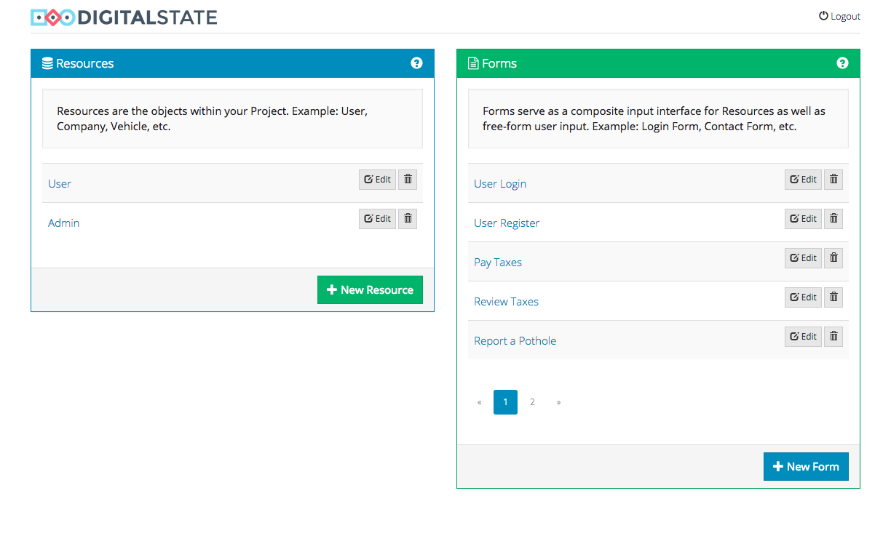
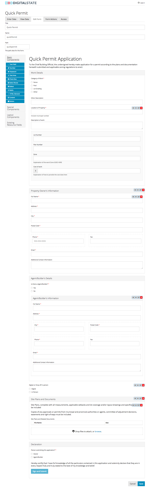
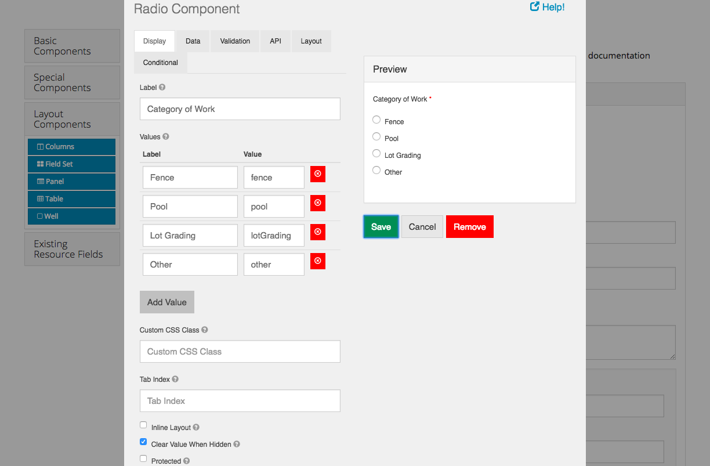

# Formio

Description...

[](https://travis-ci.org/DigitalState/Formio)
[](https://coveralls.io/github/DigitalState/Formio?branch=develop)
[](https://scrutinizer-ci.com/g/DigitalState/Formio/?branch=develop)

## Table of Contents

- [Documentation](#documentation)
- [Contributing](#contributing)
- [Credits](#credits)

## Documentation

Documentation...

## Contributing

Please read [CONTRIBUTING.md](CONTRIBUTING.md) for details on our code of conduct, and the process for submitting pull requests to us.

## Credits

This work has been developed by DigitalState.io


Then point your browser to: http://localhost:3001


# Screenshots







# Sever Validation Example

URL: `{{services}}{{environment}}/scenarios/e049f2b4-b249-48c2-850c-64d4c4b39527/submissions`

Body:

```json
{
	"data": {
		"firstName": "Morgan",
		"description": "Big pothole at street 1 and 2"
	}
}
```

Response:

```json
{
    "type": "https://tools.ietf.org/html/rfc2616#section-10",
    "title": "An error occurred",
    "detail": "data.lastName: \"lastName\" is required",
    "violations": [
        {
            "propertyPath": "data.lastName",
            "message": "\"lastName\" is required"
        }
    ]
}
```