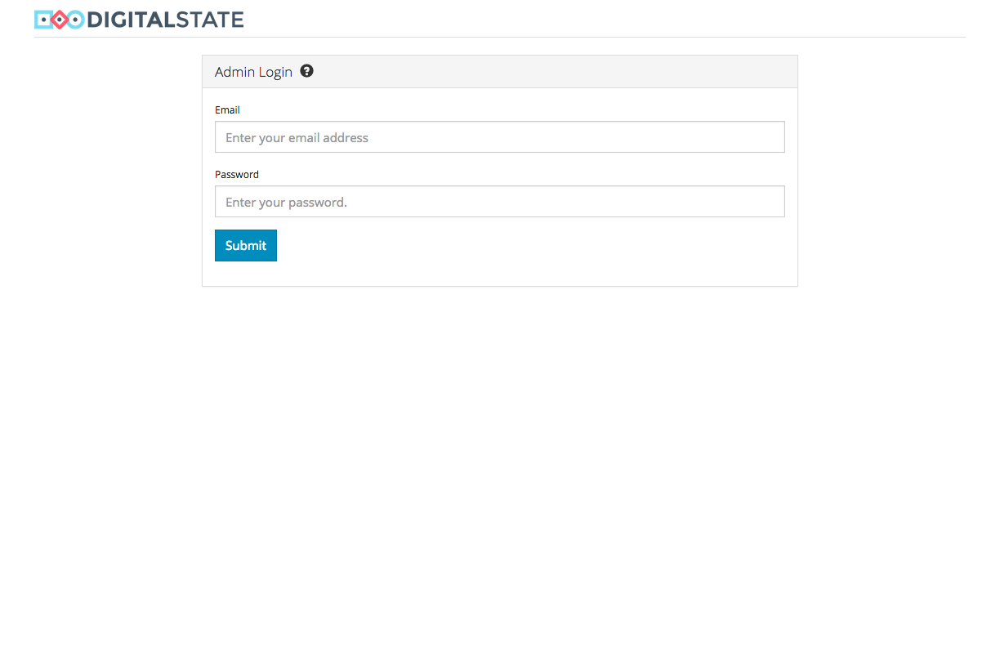
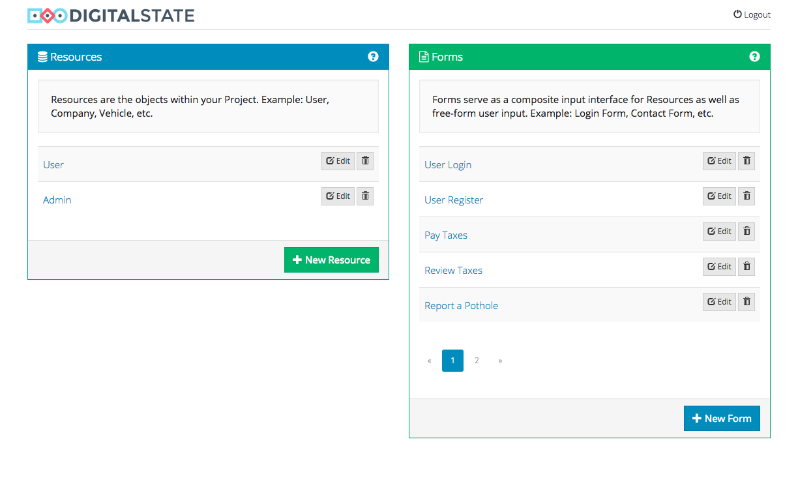
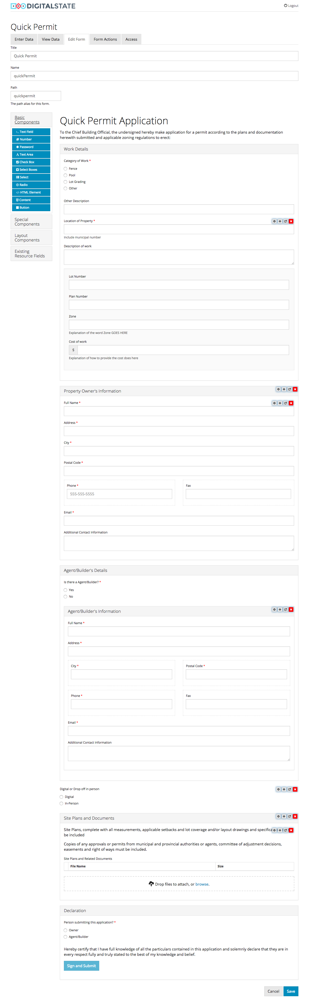
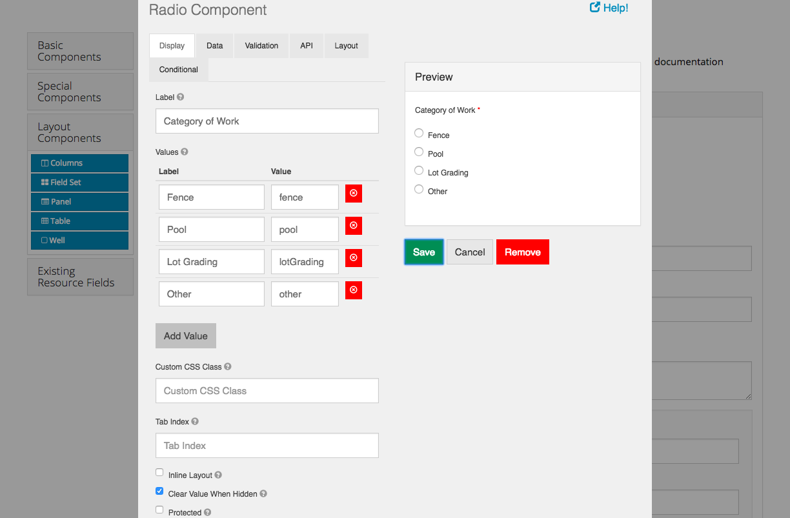

# Formio
Form.io microservice


##### Installation
```
docker-compose up -d
```

Then point your browser to: http://localhost:3001


# Screenshots







# Sever Validation Example

URL: `{{services}}{{environment}}/scenarios/e049f2b4-b249-48c2-850c-64d4c4b39527/submissions`

Body:

```json
{
	"data": {
		"firstName": "Morgan",
		"description": "Big pothole at street 1 and 2"
	}
}
```

Response:

```json
{
    "type": "https://tools.ietf.org/html/rfc2616#section-10",
    "title": "An error occurred",
    "detail": "data.lastName: \"lastName\" is required",
    "violations": [
        {
            "propertyPath": "data.lastName",
            "message": "\"lastName\" is required"
        }
    ]
}
```